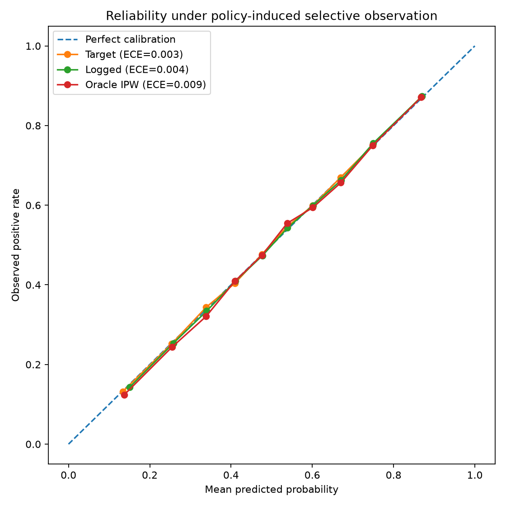

# PolicyShiftLab

PolicyShiftLab is a controlled empirical study of **policy-induced selective
observation in offline recommender-system evaluation**.

The central question is:

> When an existing recommendation policy determines which labels are observed,
> how much can offline probabilistic evaluation and model selection differ from
> evaluation on the target population?

The project focuses on evaluation rather than propensity-weighted model
training.

## Identification regime

The main synthetic benchmark studies selective observation / covariate shift
under the identifying condition

```text
Y ⟂ S | X
```

equivalently,

```text
P_log(Y | X) = P_target(Y | X)
```

while the evaluated population changes:

```text
P_log(X) != P_target(X)
```

Here `S` is the observation/exposure indicator. Under this regime, the
conditional outcome mechanism is stable; this is **not concept drift**.

When propensities are known and overlap holds, PolicyShiftLab uses the
Horvitz-Thompson finite-population estimator for target Brier risk:

```text
(1 / N) * sum_i S_i * loss_i / e_i
```

with `e_i = P(S_i = 1 | X_i)`.

The estimator can be unbiased over repeated selection draws while still having
higher finite-sample variance and RMSE than naive logged evaluation.

## What is implemented

The synthetic benchmark includes:

- a latent-factor recommender outcome model with known target probabilities;
- aligned and popularity-distorted logging policies;
- naive logged, propensity-stratified, and oracle-IPW Brier evaluation;
- repeated-selection Monte Carlo bias, variance, RMSE, and coverage analysis;
- strong-to-weak overlap stress tests with IPW effective sample size;
- target, logged, and IPW reliability curves with shared target-derived bins;
- pointwise bootstrap uncertainty bands for reliability curves;
- fixed candidate-model ranking comparisons using Brier score;
- Spearman, Kendall, pairwise reversal, and exact-order recovery diagnostics;
- Monte Carlo ranking-stability analysis across repeated exposure draws;
- overlap-by-ranking-stability sweeps;
- controlled propensity-misspecification experiments;
- a hidden-selection failure case where the identifying assumption is violated.

The Coat empirical benchmark adds:

- support and composition auditing before model evaluation;
- diagnostics for the supplied learned propensity matrix;
- a baseline logged-vs-randomized comparison;
- leakage-safe logged fit/evaluation splitting;
- estimated-propensity HT and SNIPS evaluation;
- propensity-floor sensitivity analysis;
- repeated logged holdout splits;
- model-ranking stability and reversal summaries;
- user-cluster bootstrap uncertainty on randomized benchmark comparisons.

## Main synthetic findings

The synthetic experiments illustrate four recurring patterns. Exact values are
configuration- and seed-specific; the claims are about observed patterns, not
universal numerical guarantees.

**1. IPW trades bias for variance.** Oracle IPW can substantially reduce bias
without minimizing finite-sample RMSE. Under weak overlap, inverse weights
become unstable and effective sample size falls sharply.

**2. Selective observation can change model choice.** In
`experiments/06_ranking_monte_carlo.py`, naive logged evaluation produced at
least one pairwise ranking reversal in every replication for the current
configuration, with mean Spearman agreement of `0.520`. Oracle IPW improved
mean Spearman agreement to `0.932`, but still had reversals in `0.640` of
replications. Correction improved ranking stability without eliminating
finite-sample model-selection error.

**3. Weak overlap hurts both naive and corrected selection.** In
`experiments/07_overlap_ranking_sweep.py`, expected IPW effective sample size
fell from about `6559` under strong overlap to about `1511` under weak overlap.
Over the same sweep, the naive reversal rate rose from `0.030` to `0.703`, while
the oracle-IPW reversal rate rose from `0.290` to `0.653`. IPW is therefore not
uniformly better on every finite-sample ranking metric.

**4. Identification matters more than weighting machinery.** In
`experiments/09_hidden_selection_failure.py`, a hidden variable affects both
outcome risk and exposure. Full-propensity IPW using `P(S=1 | X, Z)` was nearly
unbiased in the repeated-selection experiment, while weighting with the exact
observed-only propensity `P(S=1 | X)` retained material bias because
`Y ⟂ S | X` no longer holds.

## Coat empirical benchmark

Coat provides a biased/self-selected training matrix and a randomized test
matrix over the same `290` users and `300` items. PolicyShiftLab interprets the
randomized subset as an evaluation benchmark under Coat's **per-user randomized
item-assignment design over those users and items**, not as a universal sample
of every possible recommender deployment population.

The empirical binary outcome is `rating >= 4`. This choice supports
probability-calibration and Brier-score analysis but discards ordinal rating
information.

### Support and composition

The support audit finds:

- all `290` users and all `300` items appear in both logged and randomized data;
- all `4640` randomized observations lie inside logged user/item support;
- both matrices contain the full rating support `(1, 2, 3, 4, 5)`;
- logged `P(rating >= 4)` is `0.274`, versus `0.185` in randomized data;
- every user has `24` logged observations and `16` randomized observations;
- logged item exposure is more concentrated: item counts range from `5` to
  `88`, versus `5` to `29` in randomized data.

These differences establish a substantial composition shift while avoiding a
basic user/item support failure.

### Supplied propensities

`propensities.ascii` contains **learned**, not oracle, propensities. Its mean
propensity is `0.080019`, close to `24 / 300`, and mean row propensity mass is
`24.006`. Logged observations occur in higher-propensity regions on average
(`0.165215`) than logged-unobserved pairs (`0.072610`).

The implied logged inverse weights are variable: the observed weight range is
about `1.45` to `245.07`, with Kish effective sample size about `2211` from
`6960` logged ratings. Weighted Coat results are therefore described as
**estimated-propensity analyses**, not oracle-IPW identification guarantees.

### Leakage-safe evaluation

The primary empirical comparison separates logged model fitting from logged
evaluation. For each user, one third of logged ratings is held out with a fixed
random split; the remaining two thirds fit the candidate models. The same
fitted predictions are then evaluated on the held-out logged subset and the
randomized Coat benchmark.

Across `200` deterministic logged holdout splits:

| Method | Mean Brier error vs randomized | Mean absolute error | RMSE |
| --- | ---: | ---: | ---: |
| Held-out logged naive | `+0.037403` | `0.037403` | `0.037699` |
| Estimated HT | `+0.018260` | `0.018262` | `0.019142` |
| Estimated SNIPS | `+0.011893` | `0.011913` | `0.012905` |

Estimated-propensity weighting therefore moves metric levels materially closer
to randomized evaluation in this benchmark, while leaving non-zero discrepancy.

Model-selection stability improves but is not fully recovered:

| Method | Mean Spearman | Mean Kendall | Any reversal | Exact order recovery |
| --- | ---: | ---: | ---: | ---: |
| Held-out logged naive | `0.892` | `0.822` | `0.530` | `0.470` |
| Estimated HT | `0.919` | `0.865` | `0.400` | `0.600` |
| Estimated SNIPS | `0.919` | `0.865` | `0.400` | `0.600` |

HT and SNIPS have the same ranking summaries here because self-normalization
rescales all model scores within a split by the same positive normalization
constant.

These repeated holdouts quantify **split sensitivity conditional on this
observed Coat dataset**. They are not independent dataset replications.

### Randomized benchmark uncertainty

For the fixed leakage-safe split with seed `2026`, the numerically top two
models on randomized evaluation are `user_item_blend` and `user_smoothed`, but
their difference is negligible:

```text
Brier(user_item_blend) - Brier(user_smoothed) = -0.000092
```

A `5000`-replicate paired user-cluster bootstrap gives a percentile interval of

```text
[-0.002952, +0.002787]
```

with bootstrap probability `0.521` that `user_item_blend` has lower Brier loss.

Accordingly, the README does not describe either member of this pair as a
uniquely best model. The interval is a descriptive uncertainty summary, not a
formal hypothesis test.

### Propensity-floor sensitivity

Propensity floors at `0.01`, `0.02`, and `0.05` are reported only as
sensitivity analyses. In particular, replacing the supplied propensity with a
floored value changes the estimator; clipped HT is **not** presented as an
unbiased estimator of the original target estimand.

## Calibration diagnostics

Reliability diagrams use one set of score bins derived from the target
prediction distribution and reuse those same intervals for target, logged, and
IPW curves.



Expected calibration error (ECE) is treated as a **descriptive secondary
diagnostic** because it depends on binning and can be noisy under inverse
weighting. Brier score remains the primary probabilistic evaluation metric.

A conditionally correct predictor can remain correct under pure covariate shift
even when aggregate calibration summaries differ because the evaluated
population composition changes.

## What this project does not claim

PolicyShiftLab does **not** claim that:

- selective observation intrinsically makes a conditionally correct model
  miscalibrated;
- IPW must outperform naive evaluation in every finite sample;
- low ECE is sufficient evidence of good probability estimation;
- propensity correction solves hidden-confounding or unobserved-selection
  problems;
- a ranking reversal must occur for every policy, dataset, or candidate set;
- Coat's randomized subset is a universal target population;
- learned Coat propensities are oracle inclusion probabilities;
- explicit-rating benchmarks such as Coat or Yahoo! R3 are realistic proxies
  for all modern recommendation products.

The experiments are designed to expose assumptions and failure modes, not to
tune the data-generating process or candidate set until a preferred estimator
"wins."

## Experiments

Synthetic experiments:

```bash
python experiments/01_logged_vs_target.py
python experiments/02_monte_carlo_eval.py
python experiments/03_overlap_stress_test.py
python experiments/04_calibration_curves.py
python experiments/05_model_ranking.py
python experiments/06_ranking_monte_carlo.py
python experiments/07_overlap_ranking_sweep.py
python experiments/08_propensity_misspecification.py
python experiments/09_hidden_selection_failure.py
```

Coat experiments:

```bash
python experiments/10_coat_support_audit.py
python experiments/11_coat_propensity_audit.py
python experiments/12_coat_empirical_benchmark.py
python experiments/13_coat_heldout_benchmark.py
python experiments/14_coat_repeated_holdouts.py
python experiments/15_coat_top_pair_bootstrap.py
```

The baseline experiment `12_coat_empirical_benchmark.py` evaluates on logged
ratings also used for fitting and is retained as a baseline/mechanics check.
The leakage-safe experiments `13` through `15` should be used for the stronger
empirical claims.

## Development

Install the package in editable mode with development dependencies:

```bash
python -m pip install -e ".[dev]"
```

Run the full test suite:

```bash
pytest
```

## Yahoo! R3 empirical replication

Yahoo! R3 contains self-selected ratings and a randomized evaluation subset.
PolicyShiftLab restricts the logged comparison to the `5400` users who appear
in randomized evaluation. The randomized benchmark is therefore interpreted as
evaluation under Yahoo! R3's randomized song-assignment design for those users
over the same `1000`-item catalog, **not** as a universal target population over
all `15400` logged users.

As with Coat, the empirical binary event is `rating >= 4`. This supports
probability-quality and Brier-score comparisons while discarding ordinal rating
information.

### Support and composition

The support audit finds:

- `311704` logged observations and `54000` randomized observations;
- `15400` logged users, `5400` randomized users, and all `5400` randomized
  users present in the logged data;
- all `1000` items present in both logged and randomized data;
- all `54000` randomized observations inside logged user/item support;
- zero exact user-item pair overlap between the two files;
- full rating support `(1, 2, 3, 4, 5)` in both files;
- logged `P(rating >= 4)` of `0.401`, versus `0.088` in randomized data;
- exactly `10` randomized observations per active randomized user;
- logged item counts ranging from `14` to `5543`, versus `28` to `76` in
  randomized data.

These diagnostics show a large composition shift without a basic user/item
support failure for the randomized-user target cohort.

### Leakage-safe evaluation

Within the randomized-user cohort, logged ratings are split within user into a
fit subset and a held-out evaluation subset. Candidate models are fit only on
logged-fit ratings; held-out logged ratings and randomized ratings are
evaluation-only.

For the fixed split with seed `2026`, randomized evaluation ranks

```text
user_item_blend > item_smoothed > global > user_smoothed
```

while held-out logged evaluation ranks

```text
user_smoothed > user_item_blend > item_smoothed > global
```

For this split, Spearman agreement is `-0.200`, Kendall agreement is `0.000`,
and there are `3` pairwise reversals.

### Repeated logged holdouts

Across `200` deterministic logged holdout splits (seeds `0` through `199`), the
held-out logged-versus-randomized Brier discrepancy is:

| Summary | Value |
| --- | ---: |
| Mean signed gap | `+0.036354` |
| Mean absolute gap | `0.038664` |
| RMSE gap | `0.045996` |

Model-selection disagreement persists across all `200` splits:

| Summary | Value |
| --- | ---: |
| Mean / median Spearman | `-0.200 / -0.200` |
| Mean / median Kendall | `0.000 / 0.000` |
| Any-reversal rate | `1.000` |
| Mean reversal count | `3.000` |
| Exact-order recovery | `0.000` |
| `user_smoothed` vs `user_item_blend` reversal rate | `1.000` |

These repeated holdouts quantify **split sensitivity conditional on the
observed Yahoo! R3 dataset**. They are not independent dataset replications.

### Randomized benchmark uncertainty

For the fixed seed-`2026` fit,

```text
Brier(user_item_blend) - Brier(item_smoothed) = -0.002925
```

A `5000`-replicate paired user-cluster bootstrap gives the percentile interval

```text
[-0.004402, -0.001508]
```

with bootstrap probability `1.000` that `user_item_blend` has lower Brier loss
in the resampled randomized benchmark. This is a descriptive uncertainty
summary, not a formal hypothesis test.

No Yahoo! R3 propensity weighting is reported at this stage. Unlike the Coat
analysis, the current replication does not assume an oracle or supplied
inclusion-propensity matrix. Any weighting analysis should first define and
justify the propensity model and its identifying assumptions.

Yahoo! R3 experiments:

```bash
python experiments/16_yahoo_r3_support_audit.py
python experiments/17_yahoo_r3_heldout_benchmark.py
python experiments/18_yahoo_r3_repeated_holdouts.py
```

## Next empirical direction

The synthetic, Coat, and Yahoo! R3 phases now provide complementary evidence on
policy-induced selective observation in offline evaluation. A next empirical
extension could study a transparently specified Yahoo! R3 propensity model as a
sensitivity analysis, or add a third dataset with randomized exposure. Either
extension should define the target population and identifying assumptions
before applying correction and should not tune candidate models or data choices
to manufacture reversals.
